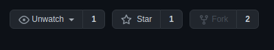
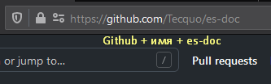
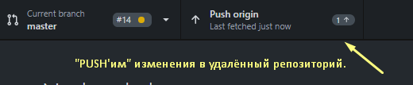
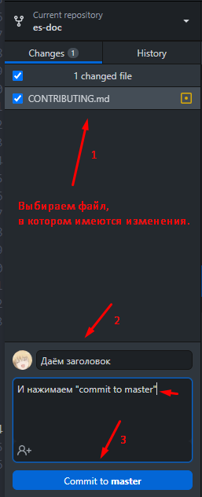

# Содействие

Здесь будут представлены базовые шаги, которые необходимы для внесения изменений в проект.

## 1. Копия репозитория

В GitHub существует понятие — форк (fork). Если вкратце, то это полная копия репозитория, в которой у вас будет полный доступ к файлам проекта, с возможностью их редактирования.

Данный подход существует для того, чтобы каждый мог сделать изменения и предложить их автору. Этот шаг будет описан ниже.

Для того, чтобы сделать форк, нужно нажать на соответствующую кнопку "Fork" на странице репозитория.



Кнопки управления репозиторием, находящиеся в правом верхнем углу.

## 2. Редактирование форка

После того, как репозиторий скопирован, он будет доступен по ссылке: `https://github.com/{ваше имя пользователя}/es-doc`.

Например, если ваше имя пользователя `Tecquo`, то форк будет доступен по ссылке: `https://github.com/Tecquo/es-doc`.



В ваш форк вы можете без опасения вносить любые изменения, будь то тестирование чего-то, исправление контента или любое, душе угодное, действие. Не забывайте, что ваши последующие изменения необходимо отправлять ("push'ить") в форк. Если у вас имеется программа `GitHub Desktop` то после сохранения изменений, кнопка `fetch origin` изменится на `push origin`, позволяя загрузить изменения в ваш репозиторий.



Но до этого, необходимо нажать на галочку рядом с файлами, в которых вы провели изменения, дать имя вашему "pull'у" (`pull` отличается от `push` тем, что он 'стягивает' изменения в ваш локальный репозиторий. Команда `push`, в свою очередь, отправляет изменения из локального репозитория в удалённый. То бишь на тот, что находится на Github. [Подробнее о pull и push](http://gitready.com/beginner/2009/01/21/pushing-and-pulling.html).) в строчке `summary` (например: `Исправил стилистические ошибки текста.`) и нажать `commit to master`. После данного действия будет доступна кнопка push'а изменений в удалённый репозиторий.
Пример принимания изменений приведён ниже.



## 3. Внесение изменений

Очень важно сохранять порядок в файлах, структуре и общем стиле репозитория. Поэтому были добавлены удобные действия, которые запускаются автоматически, например, во время добавления описания к изменениям (коммита).

На текущий момент активны следующие действия:

- во время коммита:
  - проверка и автоматическое исправление стиля в файлах `.js, .css, .md`
  - проверка ошибок в файлах `.md`
  - проверка описания коммита

Для автоматизации составления списов изменений применяются определённые правила для составления описания коммита. Используется следующая структура сообщения:

```text
<тип>[опциональная сфера изменения]: <описание>

[опциональное тело сообщения]

[опциональные нижние колонтитулы]
```

Поддерживаемые варианты типов:

- `build` - Изменение касается сборки проекта
- `chore` - Обновление команд сборки; в целом изменение, не касающееся продукции (production)
- `ci` - Изменение касается непрерывной интеграции
- `docs` - Изменение касается документации
- `feat` - Добавление новой функции
- `fix` - Исправление недочётов
- `perf` - Изменение касается улучшения производительности
- `refactor` - Изменение, которое ни исправляет ошибок, ни добавляет новых функций
- `revert` - Изменение является откатом предыдушего изменения
- `style` - Изменение стиля
- `test` - Изменение касается тестов

Примеры правильных описаний изменений:

- `feat: Добавлены списки ресурсов` - `feat`, потому что добавлена новая функция - списки, которых раньше не было
- `fix: Иcправлено отображение таблиц` - `fix`, потому что исправлена ошибка в отображении таблиц
- `docs: Обновлено / добавлено новое руководство` - `docs`, потому что изменение напрямую касается документации
- `chore: Изменена конфигурация сборки` - `chore`, потому что изменены некоторые конфигурации, которые не влияют на готовый продукт. Например, если было добавлено развернутое сообщение об ошибке при сборке, то оно не будет влиять на пользователей, а лишь добавить удобства процессу разработки
- `perf: Добавлено сжатие изображений` - `pref`, потому что влияет на производительность - сжатие изображений подразумевает повышение скорости загрузки страниц

В нижнем колонтитуле возможно использование `BREAKING CHANGE`, что оповестит об особо важных изменениях или изменения, которые влекут за собой изменения совместимости. Также добавление `!` после типа, например `feat!: Изменения дизайна сайта`, будет указывать на `BREAKING CHANGE`.

В случае неправильного описания изменений, система оповестит вас об ошибке.

## 4. Предложение изменений
