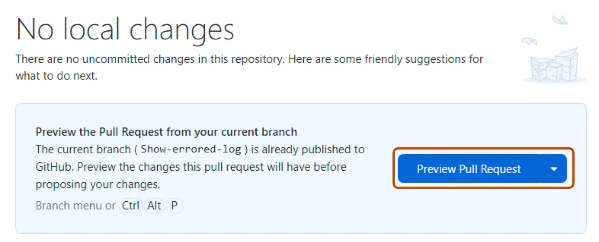
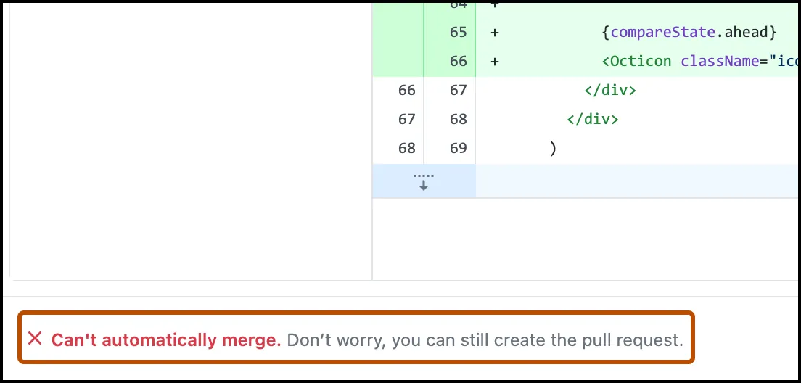

# Содействие

Здесь будут представлены базовые шаги, которые необходимы для внесения изменений в проект.

## 1. Копия репозитория

В GitHub существует понятие — форк (fork). Если вкратце, то это полная копия репозитория, в которой у вас будет полный доступ к файлам проекта, с возможностью их редактирования.

Данный подход существует для того, чтобы каждый мог сделать изменения и предложить их автору. Этот шаг будет описан ниже.

Для того, чтобы сделать форк, нужно нажать на соответствующую кнопку "Fork" на странице репозитория.

Кнопки управления репозиторием, находящиеся в правом верхнем углу.

## 2. Редактирование форка

После того, как репозиторий скопирован, он будет доступен по ссылке: `https://github.com/{ваше имя пользователя}/es-doc`.

Например, если ваше имя пользователя `Tecquo`, то форк будет доступен по ссылке: `https://github.com/Tecquo/es-doc`.

В ваш форк вы можете без опасения вносить любые изменения, будь то тестирование чего-то, исправление контента или любое, душе угодное, действие. Не забывайте, что ваши последующие изменения необходимо отправлять ("push'ить") в форк. Если у вас имеется программа `GitHub Desktop` то после сохранения изменений, кнопка `fetch origin` изменится на `push origin`, позволяя загрузить изменения в ваш репозиторий.

Но до этого, необходимо нажать на галочку рядом с файлами, в которых вы провели изменения, дать имя вашему "pull'у" (`pull` отличается от `push` тем, что он 'стягивает' изменения в ваш локальный репозиторий. Команда `push`, в свою очередь, отправляет изменения из локального репозитория в удалённый. То бишь на тот, что находится на Github. [Подробнее о pull и push](http://gitready.com/beginner/2009/01/21/pushing-and-pulling.html).) в строчке `summary` (например: `Исправил стилистические ошибки текста.`) и нажать `commit to master`. После данного действия будет доступна кнопка push'а изменений в удалённый репозиторий.
Пример принятия изменений приведён ниже.

## 3. Предложение изменений

Прежде всего, предлагаю посмотреть как Ваши изменения будут выглядеть перед тем, как сделаете pull request:
Выберите "Repository", затем "Preview pull request", здесь Вы сможете посмотреть разницу между вашим форком и оригинальным репозиторием.

Пожалуйста, не забудьте посмотреть preview до конца, если Ваши изменения по каким-либо причинам не смогут быть внесены в репозиторий (ошибка в коде, например), то GitHub об этом оповестит:

Если Вас (и GitHub) всё устраивает, то перейдём к созданию pull request:

1. Нажмите на "Repository" и выберите "Create pull request"
2. Выберите ветку, содержащую ваши изменения (обычно "master")
3. Заполните заголовок и описание pull request, желательно подробно, чтобы мне не пришлось лазить по файлам, выяснять суть PR.
4. Нажмите на кнопку "Create pull request".

Поздравляю, вы (почти) внесли вклад в летосферу! А дальше что?
Теперь осталось подождать, когда я соизволю проверить почту и узнаю о Вашем PR. Можете написать в ЛС [группы ВК](https://vk.com/sovue), если PR долгое время остаётся без ответа. Как только я его одобрю, Ваши изменения добавятся в репозиторий ES Doc, и, соответственно, на сайт, спустя минутный деплой. Не забудьте нажать кнопку "Обновить" справа снизу на ES Doc, как только изменения будут добавлены.
